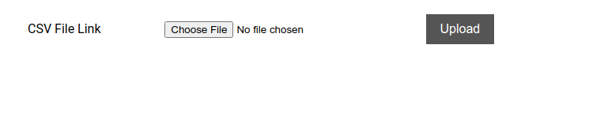
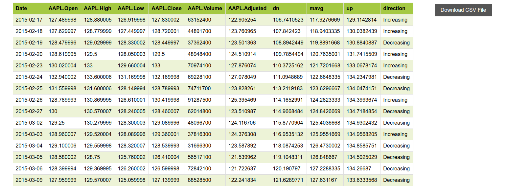
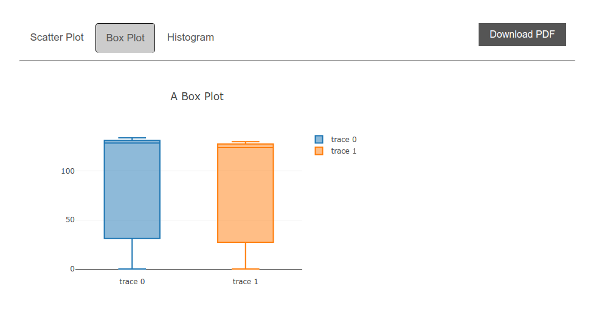

# Introduction

`djangoApp` folder contains the necessary api s and inside `static` and `templates` folder the build output files of the react app (`fontEnd-React`) are located. **Max File upload size 200MB**

[]
[]
[]

# Installation

### Docker
1. Go inside `djangoApp` directory
2. Run `docker-compose up --build`
3. After completion open browser
4. Go to `http://127.0.0.1:1337/`

> :warning: **Do not use http://localhost:1337/**: Be very careful here!

### Virtual ENV
1. Activate virtualenv
2. Run `pip install -r requirements.txt`
3. After completion open browser
4. Go to `http://127.0.0.1:8000/`

> :warning: **Do not use http://localhost:8000/**: Be very careful here!

### Bonus (React.js)
1. Go inside `frontEnd-React`
2. Run `yarn install`
3. After completion Run `yarn start`
4. `.env` file contains the **Backend API Root** as `BASE_URL` 